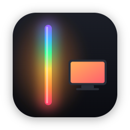
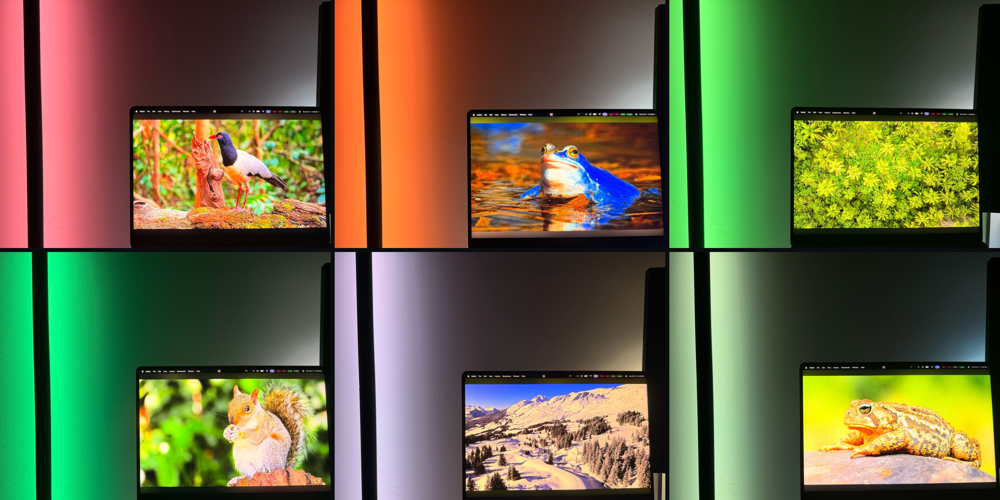
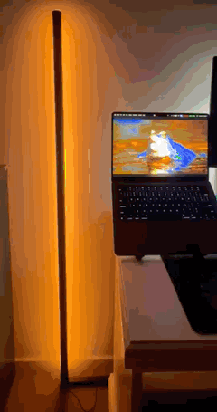
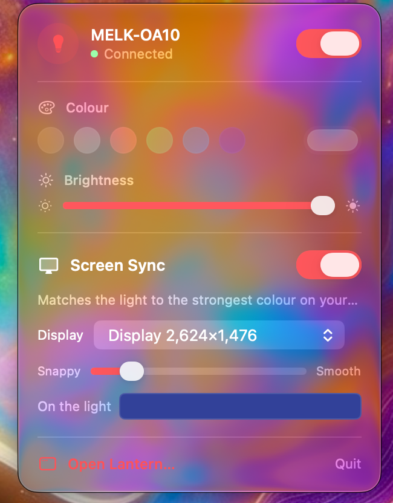
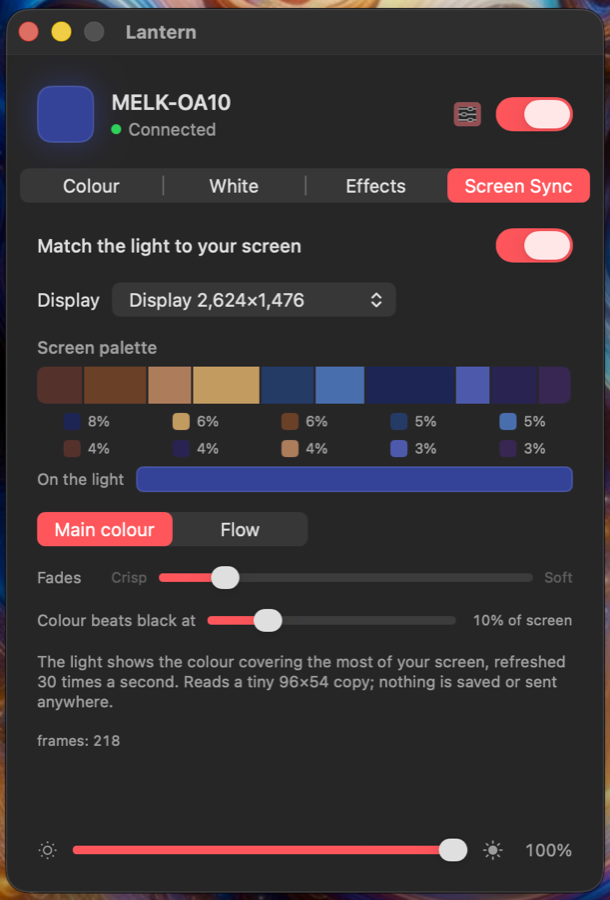
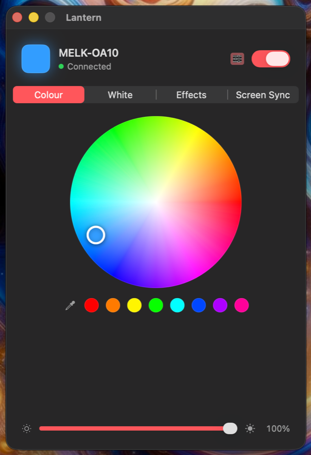
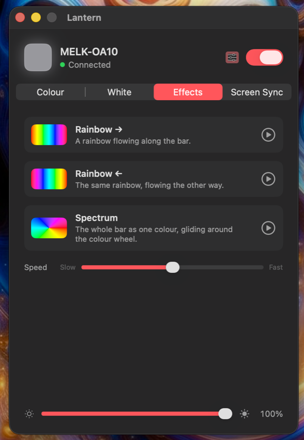

<p align="center"></p>

# Lantern

**A Mac menu bar app for Bluetooth LED bars: match the light to your screen, pick any colour, set a white, or run an effect.**



<sub>The toad (bottom right) shows how it decides: the light matched the green background, not the toad, because that covers the most of the screen.</sub>

**[Website](https://mayukh-d.github.io/lantern/)** · **[Download](https://github.com/Mayukh-D/lantern/releases/latest)** · macOS 14+

## Why I built it

Have you ever bought an inexpensive LED bar, set it up behind your desk, and wished it could follow your screen the way a Philips Hue setup does?

I wanted that feature without paying for the whole Hue ecosystem. Screen sync with Hue needs Hue lights, a Hue Bridge and the Hue Sync app, which comes to about A$550 in Australia. Instead, I bought the cheapest Bluetooth light bar I could find, for A$49, and decided to solve the problem myself.

The bar came with a phone app and a remote, but it had no way to talk to my Mac. I worked out the commands it understands over Bluetooth and wrote the missing piece. Lantern runs in the Mac menu bar and controls the light directly, so there is no hub, no account and no cloud service involved. The result is the expensive feature, running on a light that cost A$49.

| | Hue screen sync | This setup |
|---|---|---|
| Light | Hue Play gradient light tube, A$419.95 | MELK LED bar, **A$49** |
| Hub | Hue Bridge, A$129.95 | none |
| Software | Hue Sync | Lantern, free |
| **Total** | **≈ A$550** | **A$49** |

The Hue prices are Philips' Australian list prices for the [light tube](https://www.philips-hue.com/en-au/p/hue-white-and-color-ambiance-play-gradient-light-tube-large/8719514394247) and the [bridge](https://www.philips-hue.com/en-au/p/hue-bridge/8719514342569), checked in October 2026. To be fair to Hue, its gradient tube does more than my bar: it can show several colours along its length at once. My setup does the one thing I wanted, for less than a tenth of the cost.

<p align="center"><br>
<sub>The bar following the screen. <a href="https://mayukh-d.github.io/lantern/">Full video on the website</a>.</sub></p>

## What it does

| | |
|---|---|
| **Screen Sync** | Reads a tiny copy of your screen 30 times a second and sets the light to the colour covering the most of it. Black and greys compete too, so a dark scene dims the bar, and a strong colour (a red sign in a dark film) still wins over black. A **Flow** mode cycles through the screen's top ten colours instead. |
| **Colour** | A colour wheel, quick swatches, and an eyedropper that grabs any pixel on any screen. |
| **White** | A warmth scale from 2700K to 6500K with presets, and a tint control, because every RGB strip mixes white a little differently. |
| **Effects** | The bar's own flowing rainbow (both directions), plus Spectrum: the whole bar gliding around the colour wheel. |
| **Calibrate** | Screen colours look pastel on LEDs. Pick a colour (wheel, swatch or eyedropper), compare it with the bar, and adjust saturation, gamma and red/green/blue balance until they match. Settings are saved. |

It is built with SwiftUI and follows the macOS look: the menu bar panel uses the system's translucent glass material, so it picks up the colours behind it, and the app follows your accent colour and dark mode.

<table>
  <tr>
    <td width="25%"></td>
    <td width="25%"></td>
    <td width="25%"></td>
    <td width="25%"></td>
  </tr>
  <tr>
    <td align="center"><sub>Menu bar panel</sub></td><td align="center"><sub>Screen Sync</sub></td>
    <td align="center"><sub>Colour</sub></td><td align="center"><sub>Effects</sub></td>
  </tr>
</table>

## Which lights

Lantern finds Bluetooth lights advertising as **`MELK-…`** or **`ELK-…`**: the cheap LED bars and strips sold with the *Magic Lantern*, *Lotus Lantern* and *duoCo* style apps. It is tested on a **MELK-OA10** LED bar. Other lights in the family use the same commands, but built-in effect codes vary between models.

Only one controller can be connected at a time, so close the phone app before opening Lantern.

## Privacy

Screen Sync uses macOS screen capture at 96×54 pixels. Each frame is reduced to a handful of colours in memory and discarded; nothing is saved, and nothing leaves your Mac apart from colour commands to the light over Bluetooth. macOS asks for **Bluetooth** and **Screen Recording** permission the first time.

## Install

Download `Lantern-<version>.zip` from [Releases](https://github.com/Mayukh-D/lantern/releases/latest), unzip it, and move **Lantern.app** to Applications.

The app is not notarized (it is ad-hoc signed, without an Apple Developer account), so the first time you open it macOS will say it can't check it. Open **System Settings › Privacy & Security**, scroll down, and click **Open Anyway**. If you'd rather not, build it yourself (below).

## Build from source

Needs the Xcode command line tools (no Xcode project):

```bash
git clone https://github.com/Mayukh-D/lantern.git
cd lantern
./build.sh            # builds, signs ad hoc, installs to ~/Applications/Lantern.app
```

`scripts/package.sh 1.0` builds the release zip.

Rebuilding changes the app's signature, so macOS may ask for Screen Recording permission again after each build.

## Protocol notes

These lights take 9-byte frames written to characteristic **`FFF3`** of service **`FFF0`** (write without response):

| Command | Bytes |
|---|---|
| Colour | `7E 07 05 03 RR GG BB 10 EF` |
| Brightness (0–100) | `7E 04 01 BB FF FF FF 00 EF` |
| Power on / off | `7E 04 04 01 FF FF FF 00 EF` / `7E 04 04 00 00 00 FF 00 EF` |
| Built-in effect | `7E 00 03 CC 03 00 00 00 EF` |
| Effect speed (0–100) | `7E 00 02 SS 00 00 00 00 EF` |

On the MELK-OA10, effect `0x01` is a flowing rainbow and `0x02` the same in reverse. The standard ELK-BLEDOM codes (`0x87`–`0x9C`: jumps, crossfades, blinks) also work. The light only accepts a few writes in flight, so Lantern waits for `peripheralIsReady(toSendWriteWithoutResponse:)` before sending the newest colour rather than letting writes drop.

## Licence

MIT. Not affiliated with the makers of the light or its app.
